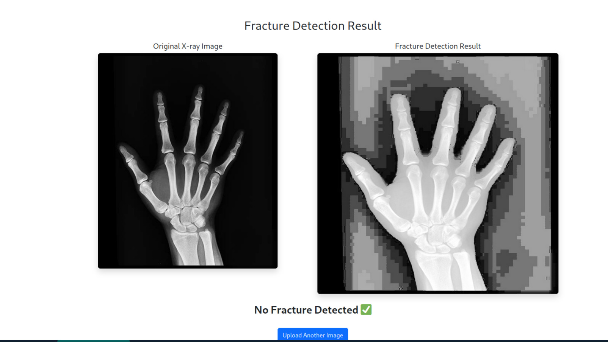
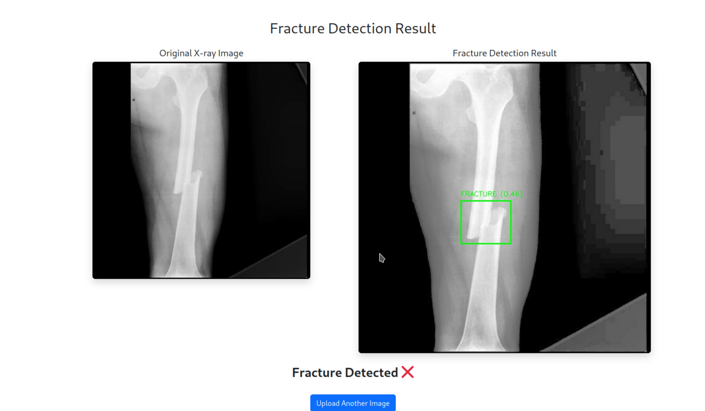

# 🦴 Fracture Detection in Arm X-rays using YOLOv8

A deep learning-based web application to detect fractures in arm X-ray images using the YOLOv8 object detection model. Built with **Python**, **OpenCV**, **Flask**, and **Ultralytics YOLOv8**, this project helps identify fractures with high confidence, highlighting the fracture area with bounding boxes.

---

## 📸 Demo


  

  


---

## 🚀 Features

- 🖼️ Upload arm X-ray images via web interface
- ⚙️ Automatic image preprocessing (grayscale + enhancement)
- 🧠 Real-time fracture detection using YOLOv8
- 📦 Bounding box visualization on fractured regions
- 🔐 Secure input handling and validation
- 💻 Run locally using Flask
- 📊 Confidence score and prediction label
- ☁️ Training performed on Google Colab

---

## 🛠️ Tech Stack

| Component     | Tech Used                       |
|---------------|----------------------------------|
| Framework     | Flask                            |
| Deep Learning | YOLOv8 (Ultralytics)             |
| Image         | OpenCV                           |
| Preprocessing | Histogram Equalization (CLAHE)   |
| Frontend      | HTML, Bootstrap (optional)       |
| Training      | Google Colab (with GPU)          |

---

## 📂 Dataset

This project uses the **[Bone Fracture Detection Dataset](https://universe.roboflow.com/fracture-uofxm/bone-fracture-detection-ivsy6/dataset/1)** from Roboflow.

> 💡 *To train the model yourself, download the dataset from Roboflow. The dataset is not included in this repo due to size constraints.*

---


## 📁 Project Structure

```plaintext
fracture-detection/
├── app.py                  # Flask backend for prediction
├── model/
│   └── best.pt             # Trained YOLOv8 model
├── templates/
│   ├── index.html          # Upload page
│   └── result.html         # Result display page
├── static/
│   ├── uploads/            # Uploaded X-ray images
│   └── results/            # Output images with bounding boxes
├── requirements.txt        # Python dependencies
└── README.md               # Project documentation

```
## ⚙️ Setup Instructions

### 1. Clone the repository
```
git clone https://github.com/Nidhul-paik/fracture-detection.git
cd fracture-detection
```

## 🧪 2. Create a Virtual Environment
```
python3 -m venv venv
source venv/bin/activate  # For MacOS/Linux
venv\Scripts\activate     # For Windows

```
## 📦 3. Install Dependencies
```
pip install -r requirements.txt
```

## ▶️ 4. Run the Application
```
python app.py
```

Then open your browser and go to:

http://127.0.0.1:5000/

